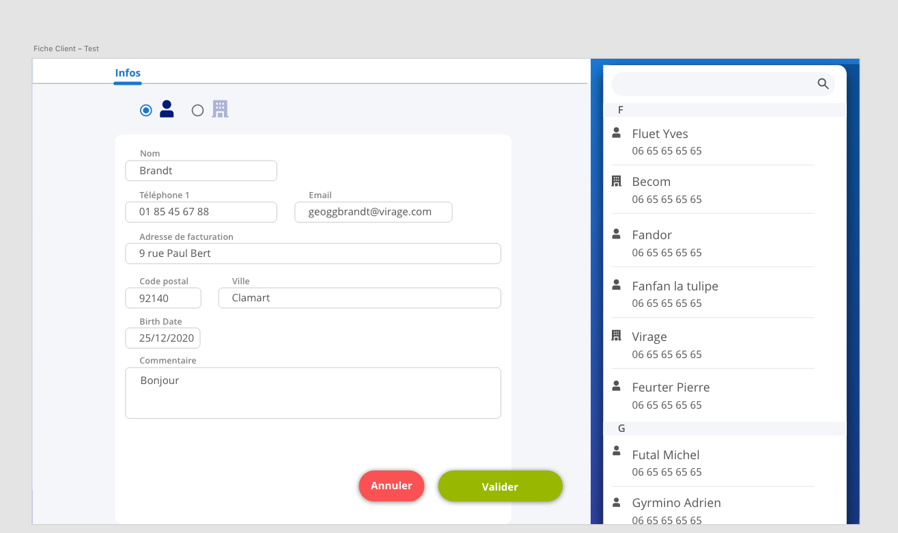

# exercice

Here is the brief :
The point of this test is to have a quick idea of your way to develop.
This test is frontend centric: we don’t expect any http requests, nor local persistance between restarts.
What we expect:
- the list on the right is feeded with local, static, in-memory data (no fancy things here)
- this list is random, you can set what you want, the only point is to have enough data to scroll through, you can use https://pub.dev/packages/faker to make it easier
- when your tap on a Customer, the form on the left appears, feeded with his data
- when you save the form, the Customer is updated (in-memory) and the Customer on the right is updated as well, the form disappears
- if you cancel, the form on the left disappears, the form content is lost
- the text fields in the form should use the material outline design instead of the one in the screen https://material.io/components/text-fields#outlined-text-field
Show us your best way to achieve this view.
Do all you can in one day, if you can’t finish it’s ok, but priorize your work to make sure you can show us the most interesting parts.
We will have a particular attention on the design fidelity.

